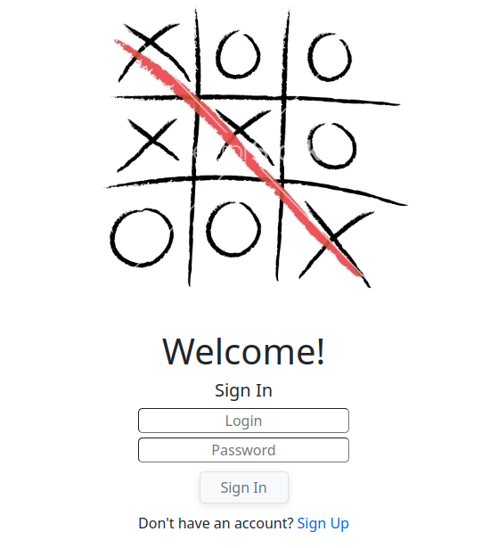

# TicTacToe WebAssembly

В данном проекте реализована веб версия игры "**Крестики-Нолики**".

Проект состоит из 3 частей:

1) **База данных (Postgres)**

Для работы с базой данных использован Entity Framework Core. Данные хранятся в виде двух таблиц: sessions и users.

2) **Серверная часть (ASP.NET Core)**

Серверная часть работает с базовой авторизацией. Все конечные точки доступны только с JWT авторизацией, кроме регистрации, авторизации пользователей и обновления accessToken. Для параллельной игры двух игроков используется библиотека SignalR. Документация API доступна по ссылке "/swagger".

3) **Клиентская часть (Blazor Wasm)**

Клиентская часть реализована с помощью фреймворка Blazor и клиентским видом рендеринга Web Assembly.

## Запуск

Для запуска необходим **Docker** и **Docker compose**.

Проект собирается в 3 взаимосвязанных контейнера с помощью **docker compose**.

**Запуск**:

Запустить скрипт:

    bash build.sh 
Адрес по умолчанию:

    http://localhost:7654

**Удаление**:

    bash delete.sh
